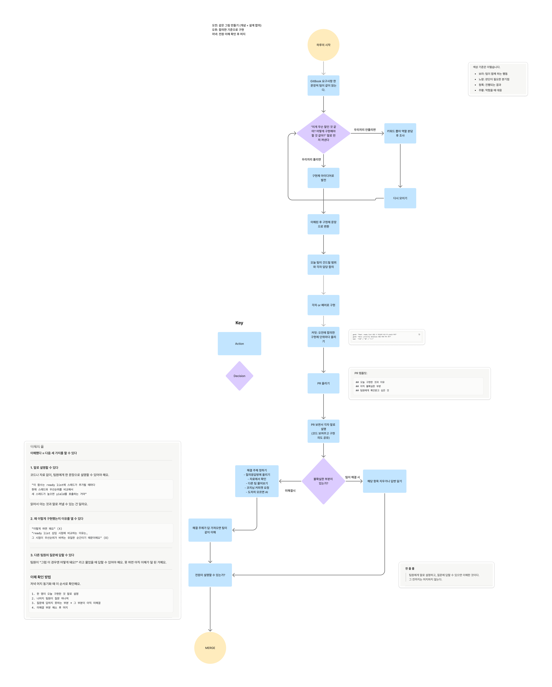

# 팀 학습 운영 가이드

> 목표: 팀 전체가 동등한 이해 수준을 가진다. 이해의 격차를 최소화한다.

---

## 핵심 원칙

- **1일 1머지**: 매일 머지된 코드를 기반으로 다음날 개발을 시작한다
- **머지 조건**: 팀원 전원이 해당 코드를 말로 설명할 수 있을 때
- **막힘의 기준**: 혼자 30분 → 팀 → 코치님 / 질의응답방 → AI (마지막)
- **AI 사용 룰**: AI의 답을 받았다면, 팀원에게 자기 말로 설명할 수 있어야 인정

---

## 이해의 룰

다음 세 가지를 할 수 있을 때 "이해했다"고 본다.

1. **말로 설명할 수 있다** — 코드나 자료 없이 팀원에게 한 문장으로 설명 가능
2. **왜인지 이유를 댈 수 있다** — "이렇게 하면 돼요"가 아니라 "왜 이렇게 하는지" 설명 가능
3. **질문에 답할 수 있다** — 팀원의 "그럼 이 경우엔?"에 답할 수 있다

---

## 하루 흐름



### 오전 — 설계 동기화
> 끝내는 기준: 팀 전체가 오늘 뭘 만들지 같은 그림을 가질 때까지

1. GitBook 요구사항 한 문장씩 팀이 같이 읽는다
2. 각자 "이게 무슨 말인 것 같아?" 말로 먼저 꺼낸다
3. 스스로 풀리면 → 구현체 아이디어로 발전
4. 개념 몰라서 막히면 → "아는 사람?" 먼저 물어보기
5. 아는 사람이 설명 → 모르는 사람 기준으로 맞추기
6. 팀 전체가 모르면 → 키워드 뽑아 역할 분담 후 조사 → 다시 모이기
7. 이해된 후 구현체 문장으로 변환
8. 오늘 팀이 건드릴 범위와 각자 담당 합의

### 오후 — 구현
> 오전에 합의한 구현체 기준으로 각자 또는 페어로 구현한다

- 막히면 혼자 30분 → 팀 → 코치님 / 질의응답방
- 커밋은 구현체 단위로 쪼갠다

```
good: feat: ready list 삽입 시 우선순위 비교 후 yield 처리
good: docs: priority donation 흐름 이해 주석 추가
bad:  수정 / 됨 / ㅇㅇ
```

### 저녁 — 머지 동기화
> 끝내는 기준: 팀원 전원이 오늘 코드를 설명할 수 있을 때

1. PR 올리기
2. PR 보면서 말로 설명 (코드 보여주며 구현 의도 공유)
3. 불확실한 부분 팀이 같이 해소
4. 해소 안 되면 → 코치님 / 질의응답방 → AI (설명 가능해야 인정)
5. 전원 설명 가능 → 머지
6. 내일 코드베이스 확인

---

## PR 템플릿

```markdown
## 오늘 구현한 것과 이유

## 아직 불확실한 부분

## 팀원에게 확인받고 싶은 것
```

---

## 자원 활용 방법

### Jungle Compass
- 오전 설계 동기화 시작 전, 오늘 학습 키워드 확인
- 주차별 목표와 오늘 구현할 범위를 연결하는 기준으로 사용

### GitBook (카이스트 핀토스 요구사항)
- 요구사항 한 문장씩 팀이 같이 읽으며 구현체로 변환하는 재료
- 모르는 개념이 나오면 키워드 뽑아 역할 분담 후 조사

### 특강
- 사전에 Jungle Compass에서 키워드 분배
- 각자 담당 키워드 집중 청취
- 특강 후 팀 모여서 순서대로 진행:
  1. 각자 담당 키워드 말로 먼저 설명
  2. 설명하다 막히는 지점 찾기
  3. 막히는 지점을 빈칸 템플릿으로 팀이 같이 채우기
  4. 오늘 구현과 연결되는 부분 확인

### 이전 주차 핀토스 코드
- 오전 설계 동기화 때 참고 자료로 활용
- "저번 주에 이 구조 어떻게 했지?"의 출발점

### 발표 피드백 / 차주 발제 조언
- 오전 설계 동기화 전, 피드백 내용 팀이 같이 확인
- "이번 주 우리가 놓쳤던 것"을 구현 방향에 반영

### 코치님 커피챗 / 질의응답방
- 팀 전체가 막혔을 때 사용하는 트리거
- 이슈가 "막힌 것" 칸에 하루 이상 있으면 → 코치님 or 질의응답방으로 올리기
- 질문 전에 "우리가 시도한 것 / 우리가 세운 가설"을 먼저 정리해서 가져가기

---

## 베스트 프랙티스

> 팀원 각자가 자신의 학습 방식을 공유합니다. PR로 추가해주세요.

### 예시: 요구사항 → 구현체 변환 방법 (나코)

요구사항 문장을 읽으며 구현체로 변환할 때 다음 순서로 접근한다.

1. 문장을 그대로 읽는다
2. "이게 코드로 하면 뭘 만들어야 하지?"를 스스로 묻는다
3. 가설을 한 문장으로 적는다
4. 모르는 개념이 나오면 물음표(?)로 표시하고 넘어간다
5. 전체 문장을 다 읽은 후, 물음표 부분을 따로 조사한다
6. 구현체 문장을 확정한다

**예시**

> "현재 실행 중인 스레드보다 높은 우선순위를 가진 스레드가 ready list에 추가되면, 현재 스레드는 즉시 yield해야 한다."
>
> → ready list에 추가될 때마다 현재 스레드와 추가된 스레드의 우선순위를 비교, 높으면 yield 호출

---

*이 문서는 팀이 함께 만들어가는 문서입니다. 개선할 부분이 있으면 PR로 올려주세요.*
